<div align="center">

<h1 style="color: #4a90e2;">🛡️ Apollo IAM Engine</h1>
<h3 style="color: #ffffff;">The Ultimate Identity, RBAC+ABAC & Zero-Trust Authentication Platform</h3>

[](#)
[](#)
[](#)
[](#)

<br>

<p style="color: #d1d5db;"><i>Documentação Executiva e Arquitetural. Framework de Soberania de Identidade projetado para ecossistemas de microsserviços de missão crítica e alta complexidade organizacional.</i></p>

</div>

---
<br>

## 1. Sumário Executivo: A Centralização da Confiança

Em arquiteturas distribuídas modernas, o gerenciamento de identidade frequentemente se torna um gargalo de segurança e manutenção. Microsserviços replicam lógicas de autorização, chaves JWT vazam, e a auditoria de acessos vira um pesadelo de conformidade.

O **Apollo IAM Engine** nasce para ser o **"Cérebro de Acesso"** de todo o ecossistema corporativo. Não é apenas um provedor de tokens; é um **Motor de Políticas Híbridas** que combina **RBAC** (Controle Baseado em Papéis), **ABAC** (Controle Baseado em Atributos), Hierarquia de Níveis de Usuário e Entidades Dinâmicas. 

Apoiado por uma infraestrutura **Zero-Trust com mTLS (Mutual TLS) nativo**, o Apollo garante que não apenas os usuários sejam autenticados, mas que os sistemas e microsserviços que o consultam também provem criptograficamente quem são.

---

## 2. A Tríade de Soberania do Apollo Engine

O Apollo foi desenhado com base em três pilares arquiteturais inegociáveis:

### ⚙️ 1. O "Policy Decision Point" (PDP) Inteligente
O coração do Apollo é o endpoint de altíssima performance `/auth/check`. Microsserviços externos **não precisam conhecer regras de negócio de acesso**. Eles delegam a decisão ao Apollo enviando uma requisição de validação.
O motor avalia em milissegundos:
*   O usuário possui a *Role* correta?
*   Ele tem a *Permission* específica para este recurso?
*   O nível dele (`user_level_rank`) é maior ou igual ao exigido pela operação?
*   Os atributos (ABAC) e Entidades Customizadas (Ex: "Centro de Custo X", "Filial Y") batem com o recurso acessado?
*   **Retorno:** Um JSON estrito contendo `allowed: true/false` e o `reason` auditável.

### 🛡️ 2. Criptografia de Borda: mTLS & PKI Autônoma
Sistemas de autenticação tradicionais são vulneráveis a ataques de *Man-in-the-Middle* caso o TLS seja quebrado. O Apollo resolve isso incorporando sua própria **Autoridade Certificadora (CA) Autônoma**.
*   No boot, o motor realiza o *Bootstrap PKI*, gerando certificados Client/Server.
*   A comunicação ocorre via **Mutual TLS (mTLS)** forçando `ECDHE+AES-GCM` ou `CHACHA20`. O cliente precisa apresentar o certificado físico (`.p12` ou `.crt/.key`) apenas para falar com a API. Sem o certificado, o aperto de mão TCP é derrubado no nível do socket.

### 🧩 3. Modelagem de Domínio Dinâmica (Custom Entities)
Diferente de sistemas engessados, o Apollo permite a criação de **Custom Entities** via API (`/admin/custom-entities/`). 
Precisa amarrar um usuário a múltiplas "Marcas", "Regiões de Vendas" ou "Grupos de Aprovação"? Você cria o tipo de entidade dinamicamente, cadastra os valores e "assina" (assign) ao usuário. O payload do token e o motor ABAC assimilam essas entidades instantaneamente, sem necessidade de alterar o esquema do banco de dados (DB Migration).

---

## 3. Deep Dive Arquitetural & Engine Capabilities

O Apollo expõe uma API rica, estritamente validada via **Pydantic (OpenAPI 3.1.0)**, dividida em domínios lógicos:

| Domínio de API | Capacidades e Responsabilidades |
| :--- | :--- |
| 🔑 **Autenticação (`/auth`)** | Login, Refresh, Revogação, Validação Total e o poderoso Endpoint de Decisão (`/auth/check`). |
| 👥 **Gestão de Identidade** | CRUD de Usuários (`/admin/users`), Reset de Senha de administrador, Toggle de Status e Tipagem de usuários. |
| 🛡️ **RBAC Core** | Criação de *Roles*, *Permissions* e *Groups*. Associação granular de Permissões -> Papéis -> Usuários. |
| 🧬 **ABAC & Levels** | RBAC Attributes (Chave-Valor) e Níveis Hierárquicos (Rankings como Junior, Sênior, C-Level) para restrições de limite de alçada. |
| 🏢 **Custom Entities** | Motor agnóstico para mapeamento estrutural externo (Ex: Usuário ID 1 atrelado ao Centro de Custo "CC-001" e Filial "SP"). |
| 📡 **Observabilidade** | Painel de Configurações Dinâmicas (tempo de expiração de JWT, limite de tentativas) e Audit Logs Imutáveis (`/admin/audit/`). |

---

## 4. O Fluxo Zero-Trust (Service-to-Service)

Veja como um microsserviço corporativo (ex: ERP de Vendas) usa o Apollo IAM Engine de forma segura:

```mermaid
sequenceDiagram
    participant U as Usuário
    participant S as Microsserviço (ERP)
    participant A as Apollo Engine (Port 8443)
    participant CA as Local PKI (mTLS)

    Note over S, CA: Conexão via Socket protegido por mTLS
    S->>CA: Apresenta client.crt e client.key
    CA-->>S: Handshake Validado
    
    U->>S: Requisição (Aprovar Pagamento 500k) + JWT Token
    S->>A: POST /auth/check (Token + RBAC/ABAC Requeridos)
    Note right of S: "Requer: permission='approve_payment', level_gte=10, entity_branch='SP'"
    
    A->>A: Verifica Assinatura JWT
    A->>A: Avalia RBAC (Roles/Permissions)
    A->>A: Avalia ABAC (Rankings e Entidades)
    
    alt Aprovado
        A-->>S: { allowed: true, reason: "All conditions met" }
        S-->>U: Pagamento Aprovado
    else Negado
        A-->>S: { allowed: false, reason: "User level (5) < Required (10)" }
        S-->>U: Acesso Negado (403)
    end
```



---

## 5. Engenharia de Produção: PKI e Telemetria

O Apollo é um *software* "Plug & Play" para infraestruturas de elite. O *boot* do sistema já evidencia sua maturidade operacional:

```text
╭─────────────────────────────────────╮
│                                     │
│    🚀 APOLLO IAM ENGINE  mTLS ON    │
│    O2 Data Solutions                │
│                                     │
╰─────────────────────────────────────╯

[INFO] mTLS: CA, Certificados do Servidor e Cliente validados.
[INFO] Uvicorn running on https://0.0.0.0:8443 (REST API + JWT)
[INFO] Uvicorn running on https://0.0.0.0:8444 (Painel Admin)
```

**Integração Client-Side (Python `httpx` com mTLS):**
Para garantir que apenas servidores autorizados conversem com o Apollo, o tráfego exige certificados físicos.
```python
import httpx, ssl

ctx = ssl.SSLContext(ssl.PROTOCOL_TLS_CLIENT)
ctx.load_verify_locations('/certs/ca/ca.crt')
ctx.load_cert_chain('/certs/client/client.crt', '/certs/client/client.key')

# Conexão blindada contra interceptação
response = httpx.post(
    'https://apollo-engine:8443/auth/check', 
    json=payload, 
    verify=ctx
)
```

---

## 🧠 Arquitetura de Alto Nível e AI-Augmented Engineering

A concepção do Apollo IAM não é apenas um feito de programação tradicional, mas o resultado de **Engenharia Aumentada por IA**. Como Arquiteto Chefe, utilizo Modelos de Linguagem e IA de fronteira para:

1.  **Geração de Boilerplate Agressiva:** Pydantic Schemas, rotas CRUD de FastAPI e injeções de dependência repetitivas são orquestrados por IA sob minha supervisão arquitetural. Isso reduz o tempo de desenvolvimento em 80%.
2.  **Foco no Core Value:** Com o código base automatizado, meu tempo e intelecto são 100% dedicados aos algoritmos críticos:
    *   Design da criptografia mTLS em tempo de execução.
    *   O algoritmo de avaliação de grafos do motor de autorização (`/auth/check`).
    *   Engenharia de resiliência e mitigação de gargalos de I/O em bancos relacionais.
3.  **Clean Architecture Pragmática:** A IA ajuda a manter o padrão do projeto (Hexagonal/DDD), garantindo que os adaptadores do banco de dados (SQLAlchemy) não poluam o Domínio de Autorização.

Esse modelo de trabalho comprova que o desenvolvedor do futuro não é um "digitador de código", mas um **Maestro de Sistemas**, orquestrando LLMs para construir infraestruturas de dados titanicas, seguras e testadas em tempo recorde.

---

## 👨‍💻 Sobre o Arquiteto

**Elias Andrade (chaos4455)**  
*Lead Solutions Architect | Enterprise IA & Cybersecurity Integrator*  
**O2 Data Solutions**

Especialista em criar "Motores Invisíveis" de alto desempenho. Do Synapsys (IA Genética para Supply Chain) ao Titan (Auth Zero-Trust S2S), o foco é resolver problemas crônicos de nível *Enterprise* através de matemática, criptografia avançada e arquitetura de software tolerante a falhas.

*   🌐 **GitHub:** [chaos4455](https://github.com/chaos4455)
*   💼 **LinkedIn:** [Elias Andrade](https://www.linkedin.com/in/itilmgf)
*   📅 **Let's Talk Business:** [Agende no Calendly](https://calendly.com/oeliasandrade/30min)

---
<p align="center">
  <sub>"Segurança não é um produto que você compra. É uma arquitetura que você constrói."</sub><br>
  <sub>© 2026 O2 Data Solutions. Todos os direitos reservados.</sub>
</p>
