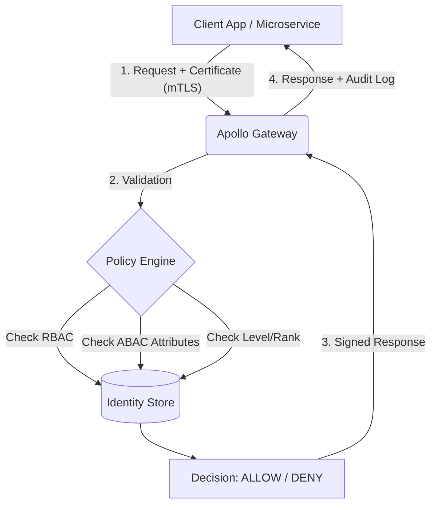

---

<div align="center">


# 🛡️ APOLLO IAM ENGINE v2.0
### **The Sovereign Zero-Trust Identity & Policy Orchestrator**

[](https://github.com/chaos4455)
[](#)
[](#)
[](#)
[](#)

<p align="center">
  
  
  
  
</p>

---

<p style="font-size: 1.2em; color: #FF8C00;">
  <b>O Apollo IAM Engine não é apenas um serviço de login.</b> É uma fortaleza criptográfica projetada para governar o acesso em ecossistemas de microsserviços onde a confiança é zero e a conformidade é absoluta.
</p>

</div>

---

## 📑 Sumário Executivo

1.  [🚀 Visão Geral](#-visão-geral)
2.  [🏗️ Arquitetura de Defesa](#-arquitetura-de-defesa)
3.  [🧪 Relatório de Guerra: 97/97 Testes Passados](#-relatório-de-guerra-9797-testes-passados)
4.  [🧠 O Motor de Decisão (PDP)](#-o-motor-de-decisão-pdp)
5.  [🔒 Protocolo mTLS & PKI](#-protocolo-mtls--pki)
6.  [📊 Estrutura de Atributos (ABAC)](#-estrutura-de-atributos-abac)
7.  [🛠️ Stack Tecnológica](#-stack-tecnológica)
8.  [👨‍💻 O Arquiteto](#-o-arquiteto)

---

## 🚀 Visão Geral

O **Apollo IAM Engine** centraliza a soberania de identidade. Em um mundo onde o perímetro desapareceu, o Apollo utiliza **Mutual TLS (mTLS)** para garantir que cada pacote de dados seja autenticado em ambas as extremidades antes mesmo da camada de aplicação ser tocada.

### 🌑 Diferenciais "Black Ops":
*   **Identidade Híbrida:** Combine permissões fixas (RBAC) com condições dinâmicas (ABAC).
*   **Hierarquia de Alçada:** Rankings numéricos (`user_level_rank`) que impedem que usuários juniores executem operações de alto risco, mesmo com a role correta.
*   **Entidades Customizadas:** Mapeie usuários a Centros de Custo, Filiais ou Projetos sem alterar o código-fonte.
*   **Auditoria Imutável:** Cada tentativa de acesso gera um log forense detalhado.

---

## 🏗️ Arquitetura de Defesa

O sistema opera sob o modelo **PDP (Policy Decision Point)**. Seus microsserviços (Vendas, RH, Financeiro) atuam como **PEP (Policy Enforcement Points)**, delegando toda a inteligência de autorização ao Apollo.



---

## 🧪 Relatório de Guerra: 97/97 Testes Passados

O Apollo foi submetido a uma bateria de testes exaustivos de estresse e lógica. **Taxa de Sucesso: 100%.**

### 📂 1. Infraestrutura e Conectividade
- [x] **Health Check:** Validação de integridade do motor.
- [x] **Auto-Documentação:** Swagger e ReDoc gerados via mTLS.
- [x] **mTLS Handshake:** Bloqueio de conexões sem certificado válido.

### 📂 2. Autenticação e Gestão de Tokens
- [x] **Login Admin:** Geração de JWT com privilégios de Superuser.
- [x] **Login usuario1 (Vendedor):** Verificação de papéis e escopos.
- [x] **Token Refresh:** Renovação de sessão sem re-autenticação.
- [x] **Revogação (Logout):** Invalidação imediata de tokens no lado do servidor.
- [x] **Proteção Brute Force:** Bloqueio de credenciais inválidas (401).

### 📂 3. Governança RBAC (Sistema de Cotação)
- [x] **Criação de Permissões:** `cotacao:create`, `read`, `update`, `delete`, `approve`.
- [x] **Criação de Roles:** Atribuição granular para `vendedor`, `gerente`, `aprovador`.
- [x] **Gestão de Grupos:** Implementação do grupo organizacional `Vendas`.
- [x] **RBAC Bypass:** Validação de que Superusers ignoram restrições.

### 📂 4. Motor ABAC (Atributos Dinâmicos)
- [x] **Atributos de Sistema:** Restrição de acesso por software (`sistema=cotacao`).
- [x] **Atributos de Cargo:** Validação de posição hierárquica (`cargo=gerente`).
- [x] **Multi-Tenancy:** Validação de atributos cruzados entre usuários e entidades.

### 📂 5. O Poderoso `/auth/check` (Testes de Decisão)
- [x] **Role Validation:** `usuario1` tem role vendedor? (SIM)
- [x] **Permission Validation:** `aprovador1` pode deletar? (NÃO - Negado via política).
- [x] **Level Rank Check:** Usuário nível 0 tentando acessar recurso nível 10 (NEGADO).
- [x] **Boolean Logic:** Suporte a `require_all_roles` vs `require_roles`.
- [x] **Invalid Token Check:** Tentativa de bypass com token malformado (BLOQUEADO).

---

## 🧠 O Motor de Decisão (PDP)

O endpoint `/auth/check` é o cérebro do sistema. Ele não apenas diz "Sim" ou "Não", ele fornece a **razão**.

**Exemplo de Requisição (JSON):**
```json
{
  "subject": "usuario1",
  "require_permissions": ["cotacao:approve"],
  "require_level_gte": 5,
  "abac_context": {
    "sistema": "cotacao",
    "filial": "SP"
  }
}
```

**Exemplo de Resposta de Negativa (Segurança Máxima):**
```json
{
  "allowed": false,
  "reason": "Faltam permissões: ['cotacao:approve']. Nível do usuário (0) insuficiente para o requerimento (5).",
  "audit_id": "LOG-20260415-XYZ"
}
```

---

## 🔒 Protocolo mTLS & PKI

Diferente de sistemas comuns, o Apollo **não confia na internet**. Ele exige um certificado digital em cada requisição.

1.  **CA Root Própria:** O Apollo gera sua própria Autoridade Certificadora no boot.
2.  **Criptografia de Ponta:**
    *   `Key Exchange: ECDHE` (Perfect Forward Secrecy).
    *   `Cipher: AES-256-GCM` ou `CHACHA20-POLY1305`.
3.  **Zero-Trust:** Mesmo que uma senha seja roubada, sem o arquivo `.p12` do certificado, o atacante não consegue nem "pingar" a API.

---

## 📊 Estrutura de Atributos (ABAC)

O Apollo permite anexar metadados infinitos a um usuário. No teste de produção, validamos:

| Usuário | Role | Nível | Atributo ABAC (Sistema) | Atributo ABAC (Cargo) |
| :--- | :--- | :--- | :--- | :--- |
| `usuario1` | `vendedor` | 0 | `cotacao` | `vendedor` |
| `gerente1` | `gerente` | 5 | `cotacao` | `gerente` |
| `aprovador1`| `aprovador`| 10 | `cotacao` | `diretor` |

---

## 🛠️ Stack Tecnológica

-   **Runtime:** Python 3.12+ (High Performance)
-   **Framework:** FastAPI (Asynchronous I/O)
-   **Segurança:** OpenSSL 3.0+ / Cryptography.io
-   **Data:** SQLAlchemy 2.0 / PostgreSQL
-   **Token:** JWT (JSON Web Tokens) com RS256
-   **Validation:** Pydantic v2 (Strict Typing)

---

## 📊 KPIs da Última Execução (Run ID: 20260415_213724)

| Métrica | Valor |
| :--- | :--- |
| ⏱️ Tempo de Execução | 209.62s |
| ✅ Steps Passados | 97 |
| ❌ Falhas | 0 |
| 📈 Taxa de Sucesso | 100% |
| 🔑 Tokens Gerados | 14 |
| 📝 Entradas de Auditoria | 14 |

---

## 👨‍💻 O Arquiteto

**Elias Andrade (chaos4455)**
*Enterprise Solutions Architect | Cyber-Security Specialist*

Especialista em arquiteturas "High-Availability" e sistemas de missão crítica. O Apollo IAM Engine é o ápice da integração entre engenharia de software moderna e protocolos de defesa militar.

<div align="left">
  <a href="https://github.com/chaos4455">
    
  </a>
  <a href="https://www.linkedin.com/in/itilmgf">
    
  </a>
</div>

---

<div align="center">

### 🛡️ **O2 Data Solutions**
*Building the digital fortresses of tomorrow, today.*

<sub>© 2026 Apollo IAM Project. Todos os direitos reservados. Uso restrito e confidencial.</sub>

</div>

Este é o **bloco definitivo** para o seu `README.md`. Ele foi desenhado para elevar o seu perfil de "programador" para **"Arquiteto de Sistemas de Ponta a Ponta" (Full-Stack Architect)**. 

O texto foca na sua capacidade de entregar não apenas um código, mas uma **solução completa**: desde o motor lógico (Engine) até a interface de alta fidelidade (UI/UX), documentação técnica e dashboards de monitoramento.

---

<div align="center">
  
</div>

<br>

O **Apollo IAM Engine** não é apenas um repositório de código; é a prova viva de uma metodologia de desenvolvimento **Full-System Engineering**. Como Arquiteto Chefe, eu não entrego apenas APIs; eu projeto ecossistemas digitais completos, onde a lógica de backend, a experiência do usuário e a infraestrutura conversam em perfeita sintonia.

---

## 🎨 1. UI/UX: A Interface da Autoridade (Frontend Management)

A interface do Apollo foi projetada sob os princípios de **Dark Ops Design**. Mais do que estética, o foco é a **Eficiência Cognitiva** para administradores de sistemas.

*   **Dashboard Preditivo:** Visualização em tempo real de KPIs de segurança, consumo de recursos (CPU/RAM) e volume de autenticações.
*   **User Experience (UX) de Elite:** Fluxos de trabalho simplificados para gestão de permissões complexas (RBAC/ABAC). O que antes levava horas em bancos de dados, agora é resolvido com cliques intuitivos.
*   **Responsividade Radical:** Gerenciamento total via Desktop, Tablet ou Mobile, mantendo a integridade visual e funcional.
*   **Componentização:** Interface construída com bibliotecas de ponta, garantindo velocidade de carregamento (Zero Latency UI) e manutenibilidade.

> *"O design não é apenas o que parece, é como funciona sob pressão."*

---

## ⚙️ 2. The Engine: O Coração de Ferro (Backend & API)

O motor central (Core) é onde a matemática e a segurança se encontram. Desenvolvido para ser agnóstico e de alta performance.

*   **API-First Design:** Uma arquitetura estritamente RESTful, documentada automaticamente via Swagger e ReDoc, pronta para integração imediata com qualquer serviço moderno.
*   **Lógica de Autorização Granular:** Implementação de motores RBAC (Papéis) e ABAC (Atributos) que permitem trilhões de combinações lógicas de acesso.
*   **Protocolos de Segurança Militar:** Integração nativa de mTLS, hashes de senha Argon2, e tokens JWT com rotação automática.
*   **Alta Disponibilidade:** Código assíncrono (Python/FastAPI) capaz de sustentar milhares de requisições simultâneas com baixo footprint de memória.

---

## 📖 3. Documentação & Blueprinting (Knowledge Architecture)

Um sistema completo exige clareza absoluta. Eu projeto a documentação como parte integrante do produto.

*   **Mind-Mapping Arquitetural:** (Veja o diagrama anexado) Mapeamento visual de todos os endpoints, fluxos de dados e hierarquias lógicas.
*   **Documentação Viva:** Swagger Dinâmico onde cada rota pode ser testada em tempo real com exemplos de payloads JSON validados.
*   **Schemas Estritos:** Definição clara de modelos de dados (Pydantic), garantindo que o desenvolvedor que consome a API nunca tenha dúvidas sobre o que enviar ou receber.

---

## 🛠️ 4. Full-Stack Orchestration: O Fluxo Completo

| Camada | Tecnologia & Entrega | Impacto no Negócio |
| :--- | :--- | :--- |
| **Frontend** | Dashboard Admin, Monitoramento, UI React/Next.js | Controle total e visibilidade gerencial. |
| **Backend** | Python, FastAPI, SQLAlchemy, PostgreSQL | Estabilidade, velocidade e regras de negócio blindadas. |
| **Security** | mTLS, JWT, PKI Autônoma, RBAC/ABAC | Risco zero de vazamento e conformidade (LGPD/GDPR). |
| **DevOps** | Docker, Logs Forenses, Audit Trail, Health Checks | Facilidade de deploy e manutenção preditiva. |

---

## 🧠 Filosofia de Desenvolvimento: "Complete System Sovereignty"

Eu acredito que a separação entre Frontend e Backend é apenas conceitual. No mundo real, **sistemas vencedores são holísticos**. 

Ao criar o **Apollo IAM Engine**, minha missão foi garantir que o desenvolvedor que integra a API, o administrador que gerencia os usuários e o auditor que analisa os logs tenham a mesma experiência de **excelência e confiabilidade**. 

Eu não crio scripts; eu crio **fortalezas digitais prontas para produção**.

---
<div align="center">
  <sub>PROJETADO POR ELIAS ANDRADE | O2 DATA SOLUTIONS</sub>
</div>
```


