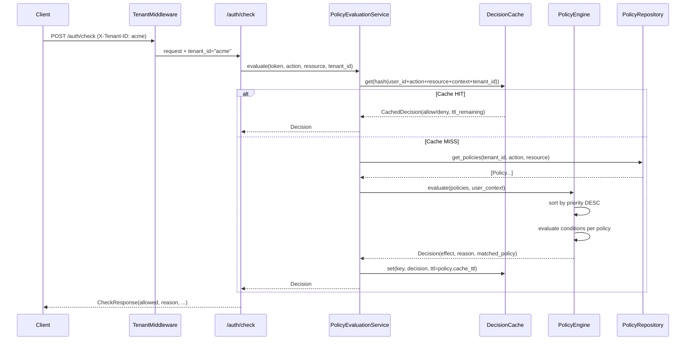
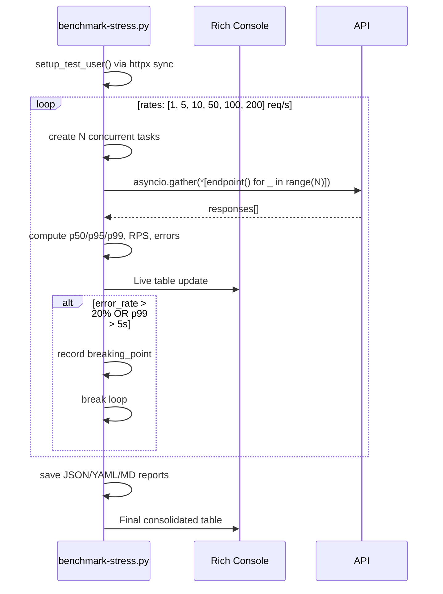

# Design Document: Apollo IAM Advanced Features

## Overview

Este documento descreve o design técnico das cinco features avançadas do Apollo IAM Engine: Stress/Benchmark Test, Policy DSL Engine, Cache de Decisão Aprimorado, Multi-Tenant e Documentação. O projeto já possui uma base sólida em Python/FastAPI com arquitetura DDD (domain/application/infrastructure/interface), JWT, RBAC/ABAC, cache LRU em memória e mTLS opcional. As features aqui descritas estendem essa base sem quebrar contratos existentes.

O foco central é a **Policy DSL Engine** — uma linguagem declarativa proprietária para definição de políticas de acesso — integrada ao endpoint `/auth/check` existente, com cache de decisão aprimorado e suporte multi-tenant. O benchmark script complementa o ciclo de desenvolvimento com métricas de performance em tempo real.

---

## Architecture

```mermaid
graph TD
    subgraph Interface Layer
        A[/auth/check] --> B[PolicyDSLRouter]
        A --> C[TenantMiddleware]
    end

    subgraph Application Layer
        B --> D[PolicyEvaluationService]
        D --> E[PolicyRepository]
        D --> F[DecisionCacheService]
    end

    subgraph Domain Layer
        D --> G[PolicyEngine]
        G --> H[ConditionEvaluator]
        G --> I[ResourceMatcher]
        G --> J[Policy Aggregate]
    end

    subgraph Infrastructure Layer
        E --> K[SqlitePolicyRepository]
        F --> L[DecisionCache - MemoryCache enhanced]
        C --> M[TenantResolver]
    end

    subgraph External
        N[benchmark-stress.py] -->|asyncio + httpx| A
        N -->|asyncio + httpx| O[/auth/token]
        N -->|asyncio + httpx| P[/auth/validate]
    end
```

---

## Sequence Diagrams

### Policy Evaluation Flow



### Benchmark Stress Flow



---

## Components and Interfaces

### Component 1: PolicyEngine (Domain)

**Purpose**: Núcleo de avaliação de políticas — recebe contexto do usuário + ação + recurso e retorna decisão.

**Interface**:
```python
class PolicyEngine:
    def evaluate(
        self,
        policies: list[Policy],
        context: EvaluationContext,
    ) -> PolicyDecision: ...
```

**Responsibilities**:
- Ordenar políticas por prioridade (maior primeiro)
- Aplicar regra Deny-Override: qualquer `deny` explícito sobrepõe todos os `allow`
- Avaliar condições via `ConditionEvaluator`
- Fazer resource matching com wildcards via `ResourceMatcher`
- Retornar decisão com motivo e política que a originou

---

### Component 2: ConditionEvaluator (Domain)

**Purpose**: Avalia uma lista de condições contra o contexto do usuário.

**Interface**:
```python
class ConditionEvaluator:
    def evaluate_all(
        self,
        conditions: list[Condition],
        context: dict[str, Any],
    ) -> bool: ...

    def evaluate_one(
        self,
        condition: Condition,
        context: dict[str, Any],
    ) -> bool: ...
```

**Operadores suportados**:

| Operador | Semântica |
|---|---|
| `eq` | igualdade estrita |
| `neq` | diferença |
| `gt` / `gte` | maior / maior-ou-igual (numérico) |
| `lt` / `lte` | menor / menor-ou-igual (numérico) |
| `in` | valor está na lista (suporta CIDR para IPs) |
| `not_in` | valor não está na lista |
| `contains` | string contém substring |
| `starts_with` | string começa com prefixo |
| `regex` | match com expressão regular |

---

### Component 3: ResourceMatcher (Domain)

**Purpose**: Verifica se um recurso alvo corresponde ao padrão da política (suporta wildcards `*`).

**Interface**:
```python
class ResourceMatcher:
    def matches(self, pattern: str, resource: str) -> bool: ...
```

**Exemplos**:
- `"*"` → qualquer recurso
- `"cotacao/*"` → qualquer sub-recurso de cotacao
- `"cotacao/123"` → recurso exato

---

### Component 4: PolicyEvaluationService (Application)

**Purpose**: Orquestra repositório, cache e engine para produzir uma decisão de acesso.

**Interface**:
```python
class PolicyEvaluationService:
    def evaluate(
        self,
        user_context: EvaluationContext,
        action: str,
        resource: str,
        tenant_id: str,
    ) -> PolicyDecision: ...

    def invalidate_for_policy(self, policy_id: str, tenant_id: str) -> None: ...
```

---

### Component 5: DecisionCache (Infrastructure)

**Purpose**: Cache de decisões com TTL por política, chave composta e suporte multi-tenant.

**Interface**:
```python
class DecisionCache:
    def get(self, key: str) -> PolicyDecision | None: ...
    def set(self, key: str, decision: PolicyDecision, ttl: float) -> None: ...
    def invalidate_tenant(self, tenant_id: str) -> int: ...
    def invalidate_policy(self, policy_id: str, tenant_id: str) -> int: ...
    def stats(self) -> CacheStats: ...

    @staticmethod
    def build_key(
        user_id: str,
        action: str,
        resource: str,
        context_hash: str,
        tenant_id: str,
    ) -> str: ...
```

**Chave de cache**: `sha256(tenant_id:user_id:action:resource:sorted_context_items)`

---

### Component 6: TenantMiddleware (Interface)

**Purpose**: Resolve `tenant_id` de cada request via header `X-Tenant-ID` ou claim JWT `tenant_id`.

**Interface**:
```python
class TenantMiddleware(BaseHTTPMiddleware):
    async def dispatch(self, request: Request, call_next) -> Response: ...
```

**Resolução de tenant** (ordem de precedência):
1. Header `X-Tenant-ID`
2. Claim `tenant_id` no JWT (se token presente)
3. Fallback: `"default"` (compatibilidade retroativa)

---

### Component 7: BenchmarkRunner (benchmark-stress.py)

**Purpose**: Script standalone de stress test com concorrência real via asyncio + httpx.

**Interface**:
```python
class BenchmarkRunner:
    async def run_scenario(
        self,
        endpoint: str,
        rate: int,          # req/s
        duration: int,      # segundos
        payload_factory: Callable[[], dict],
    ) -> ScenarioResult: ...

    async def run_all(self) -> BenchmarkReport: ...
    def save_reports(self, report: BenchmarkReport) -> None: ...
```

---

## Data Models

### Policy

```python
@dataclass
class Policy:
    id: str                          # UUID
    tenant_id: str                   # isolamento multi-tenant
    name: str                        # nome legível
    effect: Literal["allow", "deny"]
    actions: list[str]               # ["s3:GetObject", "cotacao:create", "*"]
    resources: list[str]             # ["*", "cotacao/*"]
    conditions: list[Condition]      # lista de condições AND
    priority: int                    # maior = avaliado primeiro; deny sobrepõe allow
    cache_ttl: float                 # TTL em segundos para cache desta policy (0 = sem cache)
    is_active: bool
    created_at: datetime
    updated_at: datetime
```

### Condition

```python
@dataclass
class Condition:
    field: str    # campo do contexto: "department", "user_level", "ip_range"
    op: str       # operador: "eq", "neq", "gt", "gte", "lt", "lte",
                  #           "in", "not_in", "contains", "starts_with", "regex"
    value: Any    # valor esperado (string, int, list, etc.)
```

### EvaluationContext

```python
@dataclass
class EvaluationContext:
    user_id: str
    roles: list[str]
    permissions: list[str]
    abac: dict[str, Any]      # atributos ABAC do usuário (custom entities + rbac)
    ip_address: str
    tenant_id: str
    extra: dict[str, Any]     # campos adicionais passados pelo cliente
```

### PolicyDecision

```python
@dataclass
class PolicyDecision:
    effect: Literal["allow", "deny"]
    reason: str
    matched_policy_id: str | None
    matched_policy_name: str | None
    evaluated_at: datetime
```

### ScenarioResult (Benchmark)

```python
@dataclass
class ScenarioResult:
    endpoint: str
    rate: int
    total_requests: int
    success_count: int
    error_count: int
    timeout_count: int
    latencies_ms: list[float]
    p50: float
    p95: float
    p99: float
    rps_actual: float
    breaking_point: bool
    duration_s: float
```

---

## Algorithmic Pseudocode

### Main Policy Evaluation Algorithm

```pascal
ALGORITHM evaluate_policies(policies, context, action, resource)
INPUT:
  policies: list[Policy] — políticas ativas do tenant, pré-filtradas por action/resource
  context: EvaluationContext
  action: str
  resource: str
OUTPUT: PolicyDecision

BEGIN
  // Ordena por prioridade decrescente
  sorted_policies ← sort(policies, key=priority, order=DESC)

  deny_decision ← NULL
  allow_decision ← NULL

  FOR each policy IN sorted_policies DO
    // Verifica se action está coberta pela policy
    IF NOT action_matches(policy.actions, action) THEN
      CONTINUE
    END IF

    // Verifica se resource está coberto pela policy
    IF NOT resource_matches(policy.resources, resource) THEN
      CONTINUE
    END IF

    // Avalia todas as condições (AND lógico)
    conditions_met ← evaluate_all_conditions(policy.conditions, context)

    IF conditions_met THEN
      IF policy.effect = "deny" THEN
        deny_decision ← PolicyDecision(
          effect="deny",
          reason=f"Negado pela policy '{policy.name}' (prioridade {policy.priority})",
          matched_policy_id=policy.id
        )
        BREAK  // deny explícito — para imediatamente
      ELSE  // allow
        IF allow_decision IS NULL THEN
          allow_decision ← PolicyDecision(
            effect="allow",
            reason=f"Permitido pela policy '{policy.name}'",
            matched_policy_id=policy.id
          )
        END IF
      END IF
    END IF
  END FOR

  // Deny sempre sobrepõe Allow
  IF deny_decision IS NOT NULL THEN
    RETURN deny_decision
  END IF

  IF allow_decision IS NOT NULL THEN
    RETURN allow_decision
  END IF

  // Nenhuma policy matched → deny implícito
  RETURN PolicyDecision(
    effect="deny",
    reason="Nenhuma policy permitiu o acesso (deny implícito)",
    matched_policy_id=NULL
  )
END
```

**Preconditions:**
- `policies` é uma lista válida (pode ser vazia)
- `context.user_id` é não-nulo
- `action` e `resource` são strings não-vazias

**Postconditions:**
- Sempre retorna um `PolicyDecision` (nunca lança exceção)
- Se qualquer policy com `effect="deny"` tiver condições satisfeitas → retorna deny
- Se nenhuma policy matched → retorna deny implícito

**Loop Invariants:**
- `deny_decision` é NULL ou contém a primeira policy deny que matched
- `allow_decision` é NULL ou contém a primeira policy allow que matched

---

### Condition Evaluation Algorithm

```pascal
ALGORITHM evaluate_all_conditions(conditions, context)
INPUT: conditions: list[Condition], context: dict
OUTPUT: bool

BEGIN
  IF conditions IS EMPTY THEN
    RETURN true  // sem condições = sempre satisfeito
  END IF

  FOR each condition IN conditions DO
    field_value ← context.get(condition.field)

    result ← evaluate_one(condition.op, field_value, condition.value)

    IF result = false THEN
      RETURN false  // AND lógico — falha rápida
    END IF
  END FOR

  RETURN true
END

ALGORITHM evaluate_one(op, field_value, expected)
INPUT: op: str, field_value: Any, expected: Any
OUTPUT: bool

BEGIN
  MATCH op WITH
    "eq"         → RETURN str(field_value) = str(expected)
    "neq"        → RETURN str(field_value) ≠ str(expected)
    "gt"         → RETURN float(field_value) > float(expected)
    "gte"        → RETURN float(field_value) ≥ float(expected)
    "lt"         → RETURN float(field_value) < float(expected)
    "lte"        → RETURN float(field_value) ≤ float(expected)
    "in"         → RETURN field_value IN expected  // suporta CIDR para IPs
    "not_in"     → RETURN field_value NOT IN expected
    "contains"   → RETURN str(expected) IN str(field_value)
    "starts_with"→ RETURN str(field_value).startswith(str(expected))
    "regex"      → RETURN re.match(expected, str(field_value)) IS NOT NULL
    DEFAULT      → RAISE ConditionOperatorError(f"Operador desconhecido: {op}")
  END MATCH
END
```

---

### Decision Cache Key Algorithm

```pascal
ALGORITHM build_cache_key(user_id, action, resource, context, tenant_id)
INPUT: user_id, action, resource: str; context: dict; tenant_id: str
OUTPUT: str (hex digest SHA-256)

BEGIN
  // Serializa contexto de forma determinística
  sorted_ctx ← sort(context.items(), key=item[0])
  ctx_str ← json.dumps(sorted_ctx, sort_keys=true)

  raw ← f"{tenant_id}:{user_id}:{action}:{resource}:{ctx_str}"
  RETURN sha256(raw.encode("utf-8")).hexdigest()
END
```

---

### Benchmark Rate Control Algorithm

```pascal
ALGORITHM run_at_rate(endpoint_fn, rate, duration_s)
INPUT: endpoint_fn: async callable, rate: int (req/s), duration_s: int
OUTPUT: ScenarioResult

BEGIN
  interval ← 1.0 / rate
  start_time ← now()
  latencies ← []
  errors ← 0
  timeouts ← 0

  WHILE (now() - start_time) < duration_s DO
    batch_start ← now()

    // Dispara `rate` requests em paralelo
    tasks ← [asyncio.create_task(timed_call(endpoint_fn)) FOR _ IN range(rate)]
    results ← await asyncio.gather(*tasks, return_exceptions=true)

    FOR each result IN results DO
      IF result IS TimeoutError THEN
        timeouts += 1
      ELSE IF result IS Exception THEN
        errors += 1
      ELSE
        latencies.append(result.latency_ms)
      END IF
    END FOR

    // Controle de taxa: aguarda até completar 1 segundo
    elapsed ← now() - batch_start
    IF elapsed < 1.0 THEN
      await asyncio.sleep(1.0 - elapsed)
    END IF
  END WHILE

  RETURN ScenarioResult(
    latencies=latencies,
    p50=percentile(latencies, 50),
    p95=percentile(latencies, 95),
    p99=percentile(latencies, 99),
    rps_actual=len(latencies) / duration_s,
    error_count=errors,
    timeout_count=timeouts,
    breaking_point=(errors + timeouts) / max(len(latencies), 1) > 0.20
  )
END
```

---

## Key Functions with Formal Specifications

### PolicyEngine.evaluate()

```python
def evaluate(self, policies: list[Policy], context: EvaluationContext) -> PolicyDecision
```

**Preconditions:**
- `policies` pode ser lista vazia (resultado: deny implícito)
- `context.user_id` é string não-vazia
- Todas as `Policy` em `policies` têm `is_active=True`

**Postconditions:**
- Retorna `PolicyDecision` com `effect` em `{"allow", "deny"}`
- Se qualquer policy com `effect="deny"` tiver condições satisfeitas → `result.effect == "deny"`
- Se `policies` é vazia → `result.effect == "deny"` com reason "deny implícito"
- `result.matched_policy_id` é `None` apenas no caso de deny implícito

**Loop Invariants:**
- Políticas são avaliadas em ordem decrescente de prioridade
- O primeiro `deny` encontrado interrompe a avaliação

---

### DecisionCache.build_key()

```python
@staticmethod
def build_key(user_id: str, action: str, resource: str, context: dict, tenant_id: str) -> str
```

**Preconditions:**
- Todos os parâmetros são strings não-nulas (context pode ser dict vazio)

**Postconditions:**
- Retorna string hexadecimal de 64 caracteres (SHA-256)
- Determinístico: mesmos inputs → mesmo output
- Sensível a tenant: `tenant_id="a"` ≠ `tenant_id="b"` para mesmos outros inputs

---

### TenantMiddleware.dispatch()

```python
async def dispatch(self, request: Request, call_next) -> Response
```

**Preconditions:**
- `request` é um objeto FastAPI `Request` válido

**Postconditions:**
- `request.state.tenant_id` é sempre definido após dispatch
- Se header `X-Tenant-ID` presente → usa seu valor
- Se JWT com claim `tenant_id` presente → usa claim
- Caso contrário → `tenant_id = "default"`
- Nunca lança exceção por ausência de tenant (fallback gracioso)

---

## Example Usage

### Policy DSL — JSON

```json
{
  "name": "vendedores-podem-criar-cotacao",
  "effect": "allow",
  "actions": ["cotacao:create", "cotacao:read"],
  "resources": ["cotacao/*"],
  "conditions": [
    {"field": "department", "op": "eq", "value": "sales"},
    {"field": "user_level", "op": "gte", "value": 2}
  ],
  "priority": 100,
  "cache_ttl": 300
}
```

### Policy DSL — YAML

```yaml
name: bloquear-ips-externos
effect: deny
actions: ["*"]
resources: ["*"]
conditions:
  - field: ip_address
    op: not_in
    value: ["10.0.0.0/8", "192.168.0.0/16"]
priority: 999
cache_ttl: 60
```

### Chamada ao /auth/check com Policy DSL

```python
# Cliente externo verifica acesso com contexto enriquecido
response = httpx.post("/auth/check", json={
    "token": "eyJ...",
    "action": "cotacao:create",
    "resource": "cotacao/456",
    "context": {
        "department": "sales",
        "user_level": 3,
        "ip_address": "10.0.1.5"
    }
}, headers={"X-Tenant-ID": "acme"})

# Resposta
{
    "allowed": True,
    "reason": "Permitido pela policy 'vendedores-podem-criar-cotacao'",
    "subject": "usuario1",
    "roles": ["vendedor"],
    "permissions": ["cotacao:create"],
    "abac": {"sistema": "cotacao"},
    "user_level_rank": 3,
    "matched_policy": "vendedores-podem-criar-cotacao"
}
```

### Benchmark Script — Uso

```bash
# Executa stress test completo
python benchmark-stress.py

# Saída esperada no console (Rich):
# ┌─────────────────────────────────────────────────────────────┐
# │  Apollo IAM — Stress Test  │  Run: 20260415_191342          │
# ├──────────┬──────┬──────┬──────┬──────┬──────┬──────────────┤
# │ Endpoint │ Rate │  p50 │  p95 │  p99 │  Err │ Breaking?    │
# ├──────────┼──────┼──────┼──────┼──────┼──────┼──────────────┤
# │ /token   │  50  │  12ms│  45ms│ 120ms│  0%  │ No           │
# │ /token   │ 100  │  18ms│  89ms│ 450ms│  2%  │ No           │
# │ /token   │ 200  │  45ms│ 320ms│1200ms│ 23%  │ YES ← break  │
# └──────────┴──────┴──────┴──────┴──────┴──────┴──────────────┘
```

---

## Correctness Properties

### Policy Engine

- **P1 — Deny Override**: Para qualquer conjunto de políticas P e contexto C, se existe p ∈ P tal que `p.effect == "deny"` e todas as condições de p são satisfeitas por C, então `evaluate(P, C).effect == "deny"`.
- **P2 — Deny Implícito**: Se nenhuma política em P tem condições satisfeitas por C, então `evaluate(P, C).effect == "deny"`.
- **P3 — Prioridade**: Se p1.priority > p2.priority e ambas são deny, p1 é avaliada primeiro e retornada.
- **P4 — Idempotência**: `evaluate(P, C) == evaluate(P, C)` para qualquer P e C (sem side effects).

### Cache

- **C1 — Isolamento de Tenant**: `build_key(..., tenant_id="a") != build_key(..., tenant_id="b")` para quaisquer outros parâmetros iguais.
- **C2 — Determinismo**: Mesmos inputs para `build_key` sempre produzem o mesmo hash.
- **C3 — TTL por Policy**: Uma decisão cacheada com `ttl=T` não é retornada após T segundos.
- **C4 — Invalidação**: Após `invalidate_policy(policy_id, tenant_id)`, nenhuma decisão relacionada àquela policy é retornada do cache.

### Multi-Tenant

- **MT1 — Isolamento**: Políticas de `tenant_id="a"` nunca afetam avaliações de `tenant_id="b"`.
- **MT2 — Fallback**: Requests sem `X-Tenant-ID` e sem claim JWT recebem `tenant_id="default"`.

### Benchmark

- **B1 — Breaking Point**: Um cenário é marcado como breaking point se `(errors + timeouts) / total_requests > 0.20`.
- **B2 — Percentis**: p50 ≤ p95 ≤ p99 para qualquer conjunto de latências.

---

## Error Handling

### Scenario 1: Policy com operador inválido

**Condition**: `Condition.op` contém valor não suportado (ex: `"fuzzy"`)
**Response**: `ConditionOperatorError` lançado durante avaliação; capturado pelo `PolicyEvaluationService` → retorna `PolicyDecision(effect="deny", reason="Erro de avaliação: operador inválido 'fuzzy'")`
**Recovery**: Policy é marcada como inválida no repositório; log de erro registrado

### Scenario 2: Tenant não encontrado

**Condition**: `X-Tenant-ID` presente mas tenant não existe no sistema
**Response**: `TenantMiddleware` retorna `HTTP 404` com `{"detail": "Tenant não encontrado: {tenant_id}"}`
**Recovery**: Cliente deve usar tenant válido ou omitir header para usar `"default"`

### Scenario 3: Cache indisponível

**Condition**: `MemoryCache` lança exceção (ex: OOM)
**Response**: `PolicyEvaluationService` captura exceção, loga warning, e prossegue sem cache (avalia diretamente)
**Recovery**: Degradação graciosa — sistema funciona sem cache, apenas mais lento

### Scenario 4: Benchmark — API indisponível

**Condition**: API não responde durante stress test
**Response**: `httpx.ConnectError` capturado por `BenchmarkRunner`; contabilizado como `error_count`; script não aborta
**Recovery**: Relatório final indica 100% de erros para aquela taxa; breaking point registrado

---

## Testing Strategy

### Unit Testing Approach

- `PolicyEngine.evaluate()`: testar todos os casos de Deny Override, Allow, Deny Implícito com políticas mockadas
- `ConditionEvaluator`: testar cada operador individualmente com valores válidos, inválidos e edge cases (None, tipo errado)
- `ResourceMatcher`: testar wildcards `*`, `prefix/*`, match exato, case sensitivity
- `DecisionCache.build_key()`: testar determinismo, sensibilidade a tenant, sensibilidade a contexto

### Property-Based Testing Approach

**Property Test Library**: `hypothesis`

- **Prop 1**: Para qualquer lista de políticas com pelo menos um deny que matched, `evaluate()` sempre retorna deny
- **Prop 2**: `build_key()` é determinístico — mesmos inputs sempre produzem mesmo output
- **Prop 3**: `build_key()` com `tenant_id` diferente sempre produz chaves diferentes

### Integration Testing Approach

- Testar `POST /auth/check` com `action` + `resource` + `context` + `X-Tenant-ID` contra políticas reais no banco
- Testar invalidação de cache após `PUT /admin/policies/{id}`
- Testar isolamento multi-tenant: criar políticas em tenant A e verificar que não afetam tenant B

---

## Performance Considerations

- **Cache de decisão**: TTL configurável por policy (padrão 300s). Reduz carga no banco para endpoints de alta frequência como `/auth/check`.
- **Índice no banco**: `(tenant_id, is_active)` na tabela `policies` para filtro eficiente.
- **Benchmark breaking point**: Critério de 20% de erros ou p99 > 5s para identificar limites do sistema com SQLite (dev). Em produção com PostgreSQL, os limites serão significativamente maiores.
- **asyncio no benchmark**: `httpx.AsyncClient` com `limits=httpx.Limits(max_connections=200)` para simular carga real sem overhead de threads.

---

## Security Considerations

- **Tenant isolation**: `tenant_id` é sempre resolvido server-side (header ou JWT claim). Clientes não podem injetar tenant de outro cliente via payload.
- **Policy injection**: Condições com `op="regex"` são compiladas com `re.compile()` e timeout implícito via `re.fullmatch` (sem backtracking catastrófico para padrões simples).
- **Cache poisoning**: Chave de cache inclui `tenant_id` e hash do contexto completo — impossível reutilizar decisão de outro tenant ou contexto diferente.
- **Deny by default**: Ausência de políticas resulta em deny implícito — princípio de menor privilégio.

---

## Dependencies

Todas as dependências já estão em `requirements.txt`. Nenhuma nova dependência externa é necessária:

| Dependência | Uso |
|---|---|
| `fastapi` | Rotas da Policy DSL API e middleware |
| `sqlalchemy` | ORM para tabela `policies` |
| `pydantic` | Validação dos modelos de Policy e Condition |
| `pyyaml` | Parse de policies em formato YAML |
| `httpx[asyncio]` | Benchmark stress test com concorrência real |
| `rich` | Output em tempo real no benchmark |
| `hashlib` (stdlib) | SHA-256 para chave de cache |
| `re` (stdlib) | Operador `regex` no ConditionEvaluator |
| `ipaddress` (stdlib) | Operador `in` com suporte a CIDR |
